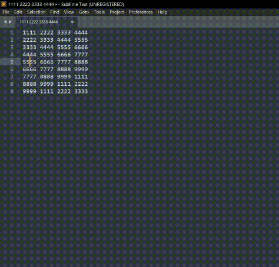

# Style Token Highlighter

A Sublime Text plugin that adds Notepad++'s **"Style all occurrences of token"** feature. Highlight tokens with **9 color styles** and **navigate** between occurrences.

## Features

*   **9 Color Styles**: Highlight different tokens simultaneously using standard syntax scopes (String, Comment, Keyword, etc.).
*   **Smart Go**: Jump to the **Next** or **Previous** same highlight of a token.
*   **Granular Control**: Clear specific styles or wipe all highlights with one click.

## Screenshots

### Highlighting Tokens
Select a word, right-click, and choose a style. All occurrences will be highlighted.



## Installation

### Via Package Control (Coming Soon)
1. Open Command Palette (`Ctrl+Shift+P` / `Cmd+Shift+P`).
2. Select `Package Control: Install Package`.
3. Search for `StyleTokenHighlighter` and press Enter.

## Usage

All commands are available via the **Command Palette** (`Ctrl+Shift+P` / `Cmd+Shift+P`) and the **right-click context menu**:

1.  **Highlight**: Select a word → Right-click → `Style Token Highlighter` → Choose a style (1-9)
2.  **Toggle**: Select a word → Command Palette → `StyleToken: Toggle Highlight (Auto Style)` (auto-picks next available style)
3.  **Go**: Place cursor on a highlighted token → Right-click → `Go to Next/Previous Same Style`
4.  **Clear**: Right-click → `Clear Specific Style` or `Clear All Style`

## Settings

You can customize the highlight colors via **Preferences > Package Settings > StyleTokenHighlighter > Settings**.

The `colors` array accepts any valid Sublime Text scope name. Default:

```json
{
    "colors": [
        "string",
        "comment",
        "keyword",
        "constant",
        "support.function",
        "variable",
        "entity.name.class",
        "invalid",
        "storage.type"
    ]
}
```

### Changing Colors

Replace any scope name with a different one. The actual color depends on your color scheme (e.g., Monokai, Mariana). Common scopes:

| Scope | Typical Color |
|-------|---------------|
| `string` | Green |
| `comment` | Gray |
| `keyword` | Purple/Blue |
| `constant` | Orange |
| `constant.numeric` | Orange |
| `variable` | Red |
| `entity.name.function` | Blue |
| `entity.name.class` | Yellow |
| `entity.name.tag` | Red |
| `support.function` | Blue |
| `storage.type` | Purple |
| `invalid` | Red background |
| `markup.heading` | Bold |
| `punctuation` | White/Gray |
| `constant.character.escape` | Cyan |

### Adding More Colors

Add more items to the array — there's no limit. Style 10, 11, 12... will become available automatically:

```json
{
    "colors": [
        "string",
        "comment",
        "keyword",
        "constant",
        "support.function",
        "variable",
        "entity.name.class",
        "invalid",
        "storage.type",
        "entity.name.function",
        "entity.name.tag",
        "constant.numeric"
    ]
}
```

### Finding Available Scopes

To see what scopes are available in your color scheme:

1. Place the cursor on any word in your code
2. Press `Ctrl+Alt+Shift+P` (Windows/Linux) or `Cmd+Alt+Shift+P` (macOS)
3. The status bar shows the scope at that position (e.g., `source.python keyword.control`)

Use these scope names in your `colors` array.

## Key Bindings

This package doesn't ship key bindings to avoid conflicts with your existing shortcuts. To set up your own, open **Preferences > Key Bindings** and copy the examples below. Customize the key combinations to your liking.

```json
// Toggle highlight (auto-picks next available style)
{ "keys": ["ctrl+k", "ctrl+h"], "command": "style_token_toggle_highlight" },

// Highlight with specific style (color_index 0-8)
{ "keys": ["ctrl+k", "ctrl+1"], "command": "style_token_highlight", "args": {"color_index": 0} },
{ "keys": ["ctrl+k", "ctrl+2"], "command": "style_token_highlight", "args": {"color_index": 1} },
{ "keys": ["ctrl+k", "ctrl+3"], "command": "style_token_highlight", "args": {"color_index": 2} },
{ "keys": ["ctrl+k", "ctrl+4"], "command": "style_token_highlight", "args": {"color_index": 3} },
{ "keys": ["ctrl+k", "ctrl+5"], "command": "style_token_highlight", "args": {"color_index": 4} },
{ "keys": ["ctrl+k", "ctrl+6"], "command": "style_token_highlight", "args": {"color_index": 5} },
{ "keys": ["ctrl+k", "ctrl+7"], "command": "style_token_highlight", "args": {"color_index": 6} },
{ "keys": ["ctrl+k", "ctrl+8"], "command": "style_token_highlight", "args": {"color_index": 7} },
{ "keys": ["ctrl+k", "ctrl+9"], "command": "style_token_highlight", "args": {"color_index": 8} },

// Navigate between highlights
{ "keys": ["ctrl+k", "ctrl+n"], "command": "style_token_go_next" },
{ "keys": ["ctrl+k", "ctrl+p"], "command": "style_token_go_prev" },

// Clear all highlights
{ "keys": ["ctrl+k", "ctrl+0"], "command": "style_token_clear_all_highlight" }
```

For more information on key bindings, see the [Sublime Text documentation](https://docs.sublimetext.io/reference/key_bindings.html).

## Context Menu

This package ships a context menu by default. To customize or disable it:

1. Open the `Packages` directory (via **Preferences > Browse Packages...**).
2. Create a `StyleTokenHighlighter` directory inside it (if it doesn't exist).
3. Create a `Context.sublime-menu` file in that directory.

To **disable** the context menu completely, put this in the file:

```json
[]
```

To **customize** it, copy the [original menu](https://github.com/leoshome/StyleTokenHighlighter/blob/master/Context.sublime-menu) and remove or modify the entries you don't need.

Your copy overrides the one shipped with the package. See the [official documentation](https://www.sublimetext.com/docs/packages.html#overriding-files-from-a-zipped-package) for more details.

---

## Attribution

This plugin was written with AI assistance and reviewed by the author.

## License

This project is licensed under the MIT License - see the [LICENSE](LICENSE) file for details.


